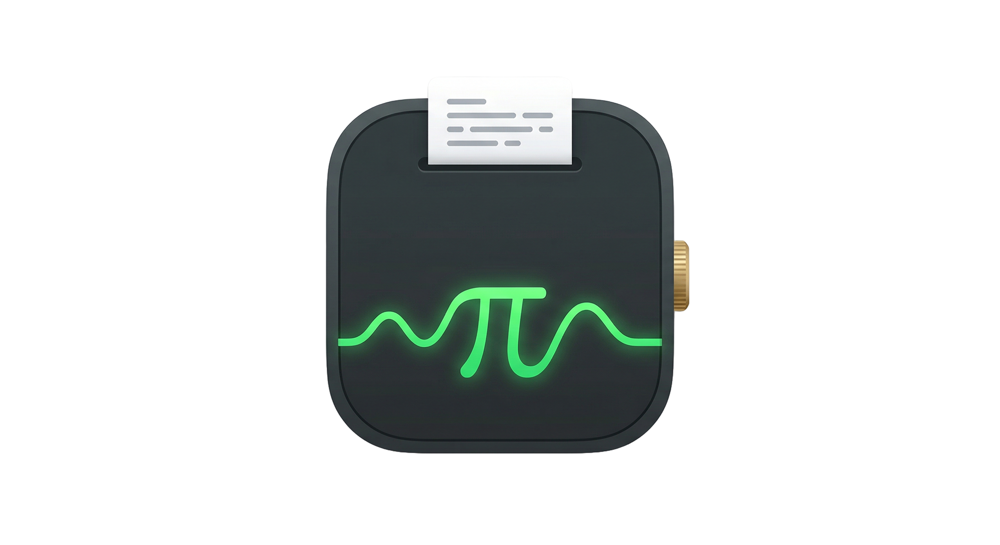

# VoicePi

[](https://github.com/pi-dal/VoicePi/actions/workflows/ci.yml)
[](https://github.com/pi-dal/VoicePi/releases)
[](LICENSE)
[](#install-with-homebrew)

VoicePi is a macOS 14+ menu-bar voice input app built with Swift Package Manager.

It lets you press a keyboard trigger to start recording speech, transcribe audio with either Apple Speech or a remote OpenAI-compatible ASR model, optionally refine the transcript with an OpenAI-compatible LLM, and then paste the final text into the currently focused input field when you press the trigger again.



## Repository

VoicePi is hosted on GitHub. See the repository for source code, issue tracking, and release packaging updates:

- [https://github.com/pi-dal/VoicePi](https://github.com/pi-dal/VoicePi)

VoicePi is released under the [MIT License](LICENSE).

## Features

- Menu-bar only app (`LSUIElement`)
- Apple Speech local transcription support
- Remote OpenAI-compatible large-model ASR support
- Real-time floating capsule overlay with live waveform
- Clipboard-based paste injection with automatic clipboard restore
- Temporary switch from CJK input methods to ASCII before paste, then restore
- Configurable recognition language
- Configurable ASR backend and remote ASR credentials
- Optional LLM refinement for conservative ASR correction
- SwiftPM build
- Makefile for build, run, install, and clean
- Signed `.app` bundle output via ad-hoc signing by default

## Requirements

- macOS 14 or newer
- Xcode Command Line Tools or full Xcode
- Microphone permission
- Speech Recognition permission
- Accessibility permission for paste injection and advanced shortcut suppression
- Input Monitoring permission only for advanced global shortcuts

## Project Structure

- `Package.swift` — SwiftPM manifest
- `Makefile` — build, verify, package, run, install, and clean helpers
- `.github/workflows/ci.yml` — macOS test workflow for pushes and pull requests
- `.github/workflows/release.yml` — tag-driven GitHub Release and Homebrew cask update workflow
- `Casks/voicepi.rb` — Homebrew cask definition kept in sync with tagged releases
- `Scripts/test.sh` — repository-level test entrypoint for Swift and shell checks
- `Scripts/verify.sh` — development verification workflow that builds the debug app bundle
- `Scripts/package.sh` — release packaging workflow that verifies first, then exports the release app bundle
- `Scripts/prepare_release.sh` — release helper that packages the zip asset, computes SHA256, and refreshes the cask metadata
- `Scripts/write_homebrew_cask.sh` — Homebrew cask writer used by the release workflow
- `Scripts/bundle_app.sh` — legacy alias that forwards to the packaging workflow
- `LICENSE` — MIT open-source license text
- `Sources/VoicePi` — app source
- `dist/debug/VoicePi.app` — development app bundle generated by the verification flow
- `dist/release/VoicePi.app` — exported app bundle generated by the packaging flow

## Build

The project now uses a two-step workflow:

1. **Verify** — for normal development testing
2. **Package** — for release export after verification succeeds

### Verification workflow

Use this during everyday development:

```/dev/null/sh#L1-1
./Scripts/verify.sh
```

or:

```/dev/null/sh#L1-1
make verify
```

This builds and bundles the development app at:

```/dev/null/text#L1-1
dist/debug/VoicePi.app
```

### Packaging workflow

Use this when the verification build is confirmed to be good:

```/dev/null/sh#L1-1
./Scripts/package.sh
```

or:

```/dev/null/sh#L1-1
make package
```

The packaging workflow runs verification first, then produces the exported app bundle at:

```/dev/null/text#L1-1
dist/release/VoicePi.app
```

The release bundle is ad-hoc signed by default.

### Legacy alias

If you still use the older packaging script, it now forwards to the packaging workflow:

```/dev/null/sh#L1-1
./Scripts/bundle_app.sh
```

## Run

### Run development app bundle

```/dev/null/sh#L1-1
make run
```

This opens the verification bundle:

```/dev/null/text#L1-1
dist/debug/VoicePi.app
```

### Run the Swift executable directly

```/dev/null/sh#L1-1
swift run
```

Note that the full app experience is best when launched as the generated `.app` bundle, since permissions and app-bundle behavior are more consistent there.

## Install

Install into `/Applications`:

```/dev/null/sh#L1-1
make install
```

This runs the packaging flow if needed, then copies:

```/dev/null/text#L1-1
dist/release/VoicePi.app
```

to:

```/dev/null/text#L1-1
/Applications/VoicePi.app
```

## Install with Homebrew

VoicePi can be installed through Homebrew by tapping this repository directly:

```sh
brew tap pi-dal/voicepi https://github.com/pi-dal/VoicePi
brew install --cask pi-dal/voicepi/voicepi
```

The release workflow keeps `Casks/voicepi.rb` aligned with the latest tagged GitHub Release so the cask points at the matching zip asset and checksum.

## Distribution

VoicePi supports two practical distribution paths.

### Internal testing distribution

Use this path when you want to share builds quickly with a small number of testers:

```sh
./Scripts/package_zip.sh
```

The script runs the normal packaging flow first, then creates:

```text
dist/release/VoicePi-macOS.zip
```

If you prefer Make targets, this repository also exposes:

```sh
make zip
```

Share `dist/release/VoicePi-macOS.zip` with testers. The default release bundle is ad-hoc signed, so macOS Gatekeeper may block it on other machines. Testers can usually open it by right-clicking the app and choosing **Open**, or by removing the quarantine attribute after download:

```sh
xattr -dr com.apple.quarantine /Applications/VoicePi.app
```

### Formal external distribution

Use this path when you want normal macOS installation behavior for external users.

1. Sign the app with a valid Apple Developer `Developer ID Application` certificate.
2. Submit the signed app to Apple notarization.
3. Staple the notarization ticket to the app.
4. Package the notarized app as a `.zip` or `.dmg` for distribution.

This repository already supports passing a signing identity into the packaging flow:

```sh
CODESIGN_IDENTITY="Developer ID Application: Your Name (TEAMID)" ./Scripts/package.sh
```

Signing alone is not enough for a smooth external install experience. If you distribute VoicePi outside your own machine, you should notarize the app before publishing it.

## Release Automation

The repository ships with two GitHub Actions workflows:

- `CI` runs `./Scripts/test.sh` on macOS for pull requests.
- `Release` runs when you push a tag that starts with `v`, packages `dist/release/VoicePi-macOS.zip`, creates or updates the matching GitHub Release, and rewrites `Casks/voicepi.rb` on `main`.

VoicePi follows Epoch Semantic Versioning, using the normal SemVer `MAJOR` position as `epoch * 1000 + technical_major`. In practice:

- `PATCH` is for backwards-compatible fixes.
- `MINOR` is for backwards-compatible features.
- `MAJOR` is for smaller incompatible changes that should still be progressive to adopt.
- `EPOCH` is reserved for genuinely new eras of the product and appears as jumps like `v1000.0.0`.

That means the first public release is `v1.0.0`, and later progressive breaking changes can move to `v2.0.0`, `v3.0.0`, and so on without implying a marketing reset.

Create a release like this:

```sh
git tag v1.0.0
git push origin v1.0.0
```

The tag should follow `v<semver>`, for example `v1.2.3`. The workflow uses the tag version for both the GitHub Release asset URL and the Homebrew cask metadata.

## Clean

```/dev/null/sh#L1-1
make clean
```

## Permissions

VoicePi needs four macOS permissions for the full shortcut-to-paste flow:

1. **Microphone**
2. **Speech Recognition**
3. **Accessibility**
4. **Input Monitoring**

### Why each permission is needed

- **Microphone**: records your voice
- **Speech Recognition**: required when using the local Apple Speech backend
- **Accessibility**: required to inject the final paste, and also required if you use advanced shortcuts that need suppression
- **Input Monitoring**: required only for advanced global shortcuts such as modifier-only, `fn`-based, or multi-key chords

If you switch to a remote ASR backend, the app still needs **Microphone**, but local **Speech Recognition** may no longer be the primary transcription path.

### Granting permissions

On first run, VoicePi refreshes permission state without forcing every prompt up front. VoicePi requests permissions when you use the feature that needs them. If you already denied one of them in an earlier run, macOS may not show the prompt again and you will need to re-enable it in System Settings.

You can also open the in-app **Settings → Permissions** section, which provides direct buttons for:

- **Open Microphone Settings**
- **Open Speech Recognition Settings**
- **Open Accessibility Settings**
- **Open Input Monitoring Settings**
- **Refresh Permission Status**

If needed, you can still open the pages manually:

- **System Settings → Privacy & Security → Microphone**
- **System Settings → Privacy & Security → Speech Recognition**
- **System Settings → Privacy & Security → Accessibility**
- **System Settings → Privacy & Security → Input Monitoring**

Make sure `VoicePi.app` is enabled in each relevant section.

## Usage

1. Launch `VoicePi.app`
2. Grant the requested permissions for the features you use. **Accessibility** is needed for paste injection, while **Input Monitoring** is only needed if you choose an advanced shortcut.
3. A microphone icon appears in the menu bar
4. Press the configured hotkey trigger to start recording
5. Speak
6. Press the trigger again to stop recording
7. VoicePi injects the final transcribed text into the currently focused input field

While recording, a floating capsule appears centered near the bottom of the screen and shows:

- live waveform bars driven by real audio RMS
- live streaming transcript text

If LLM refinement is enabled and configured, the capsule shows a refining state before text is pasted.

## Current Trigger Behavior

The intended trigger behavior is:

- press **Option + Fn** to start recording
- press it again to inject text

The **Home** section in Settings also summarizes this trigger flow and explains the basic VoicePi workflow for new users.

If you are modifying the app behavior, make sure the key monitor logic and the menu/help text stay aligned with the current configured trigger.

## ASR Backends

VoicePi supports two ASR modes:

- **Apple Speech** — local/system speech recognition
- **Remote ASR** — an OpenAI-compatible remote transcription endpoint

Configure the backend in **Settings → ASR**:

- **Backend** chooses between Apple Speech and the remote large-model path
- **API Base URL**, **API Key**, and **Model** are required for Remote ASR
- **Prompt** is optional and can be used to bias technical terms, product names, or mixed-language dictation
- **Test Connection** sends a lightweight endpoint probe before you save

When **Remote ASR** is selected, VoicePi captures audio locally while you hold the shortcut, uploads the recorded file after release, and injects the returned transcript.

If you feel the built-in local recognizer is not accurate enough, switch to **Remote ASR** in the app settings.

### Recommended usage

- Use **Apple Speech** if you want a fully local built-in path and simple setup
- Use **Remote ASR** if you want stronger recognition quality, especially for mixed Chinese-English dictation and technical terms

## ASR Settings

VoicePi now has a dedicated **ASR** section in the unified settings window.

From the menu bar:

- open **Settings…**
- open the **ASR** section

There you can configure:

- **ASR Backend**
  - `Apple Speech`
  - `Remote ASR`
- **Recognition Language**
- **API Base URL** for remote ASR
- **API Key** for remote ASR
- **Model** for remote ASR
- **Test** and **Save** actions for remote ASR configuration

## Language Selection

VoicePi supports these recognition languages:

- Simplified Chinese (`zh-CN`) — default
- Traditional Chinese (`zh-TW`)
- English (`en-US`)
- Japanese (`ja-JP`)
- Korean (`ko-KR`)

You can change the recognition language from the ASR settings section and, depending on the current app build, from the menu bar language submenu.

The selected language is stored in `UserDefaults`.

## Remote ASR

Remote ASR is designed for cases where Apple Speech is not accurate enough.

It uses an OpenAI-compatible transcription API and is intended to support stronger large-model speech recognition.

### Typical remote ASR flow

1. Hold the configured shortcut
2. VoicePi records audio locally
3. On release, the recorded audio is sent to the configured remote ASR endpoint
4. VoicePi receives the transcript
5. If LLM refinement is enabled, the transcript can be conservatively cleaned up
6. The final text is pasted into the focused field

### Remote ASR configuration

In **Settings → ASR**, provide:

- **API Base URL**
- **API Key**
- **Model**

The API must support an OpenAI-compatible transcription-style workflow.

### Notes

- Remote ASR requires network access
- Remote ASR usually provides better recognition quality than local Apple Speech
- API keys are not hardcoded into the app
- If your provider requires a nonstandard base path, set the Base URL accordingly

## LLM Refinement

VoicePi can optionally refine transcripts using an OpenAI-compatible API.

The refinement prompt is intentionally conservative:

- only fix obvious recognition mistakes
- preserve correct text exactly
- avoid rewriting or polishing
- support mixed Chinese-English correction
- fix obvious technical-term ASR errors such as:
  - `配森` → `Python`
  - `杰森` → `JSON`

### Configure LLM Refinement

From the menu bar:

- open **LLM Refinement**
- enable refinement
- open **Settings…**

The settings window is organized into multiple sections:

- **Home** — product introduction, quick usage overview, and feature summary
- **Permissions** — direct permission status for Microphone, Speech Recognition, Accessibility, and Input Monitoring, plus buttons that jump to the relevant macOS settings pages and explain what each one controls
- **ASR** — backend selection, recognition language, and remote ASR configuration
- **LLM** — API Base URL, API Key, Model, Test, and Save controls

Fill in:

- **API Base URL**
- **API Key**
- **Model**

Then use:

- **Test** — verify the API works
- **Save** — persist the configuration

The API key field can be fully cleared.

### Notes

- The API must expose an OpenAI-compatible chat completions endpoint
- If your provider uses a custom base path, set the base URL accordingly
- The app does not hardcode any API key

## Input Method Handling

Before paste injection, VoicePi checks the current macOS input source.

If the current input method looks like a CJK input method, VoicePi temporarily switches to an ASCII-capable input source such as:

- `ABC`
- `US`

It then:

1. saves the clipboard
2. writes the final text to the clipboard
3. simulates `Cmd+V`
4. restores the clipboard
5. restores the original input source

This prevents some CJK input methods from intercepting the paste action incorrectly.

## Notes on Signing

The generated app bundle is signed by default with ad-hoc signing.

If you want to sign with a real certificate, you can override the signing identity when invoking `make`:

```/dev/null/sh#L1-1
make release SIGN_IDENTITY="Developer ID Application: Your Name"
```

## Troubleshooting

### The app launches but does not record

Check:

- microphone permission
- if using Apple Speech, speech recognition permission
- accessibility permission for paste injection, and for advanced shortcut suppression if you use an advanced shortcut
- input monitoring permission if your configured shortcut is an advanced shortcut
- selected language availability on the machine
- whether the configured shortcut is the one you are actually pressing

### The app does not paste text

Check:

- accessibility permission
- whether the target app accepts paste
- whether the focused field is actually active

### The emoji picker still appears

This usually means the advanced shortcut interception path is not active, Input Monitoring is blocking an advanced shortcut, or Accessibility is blocking advanced shortcut suppression.

### The shortcut does not respond at all

Check:

- if your configured shortcut is advanced, **Input Monitoring** is enabled for `VoicePi.app`
- **Accessibility** is enabled for `VoicePi.app` if you expect paste injection to work
- if your configured shortcut is advanced, relaunch VoicePi after changing Input Monitoring if macOS did not apply it immediately
- the shortcut shown in **Settings → Home** matches the keys you are pressing

### The transcript is empty

Possible causes:

- microphone input level is too low
- the selected ASR backend is misconfigured
- the remote ASR API Base URL, API Key, or Model is incorrect
- the remote ASR provider returned an error
- Apple Speech is too weak for the spoken language/content in your environment
- speech recognition permission is missing
- the recognizer is unavailable for the selected locale
- the trigger was released too quickly

### LLM refinement does not work

Check:

- API base URL
- API key
- model name
- endpoint compatibility with OpenAI chat completions format
- network access

## Development Notes

This app is implemented with AppKit and system frameworks including:

- `AppKit`
- `ApplicationServices`
- `AVFoundation`
- `Carbon`
- `Speech`

The floating overlay uses:

- `NSPanel`
- `NSVisualEffectView`
- Core Animation-backed waveform bars

## Typical Workflow

Build and run locally:

```/dev/null/sh#L1-4
make debug
make run
# or
make release
```

Install system-wide:

```/dev/null/sh#L1-1
make install
```

## License

Add your preferred license here.
